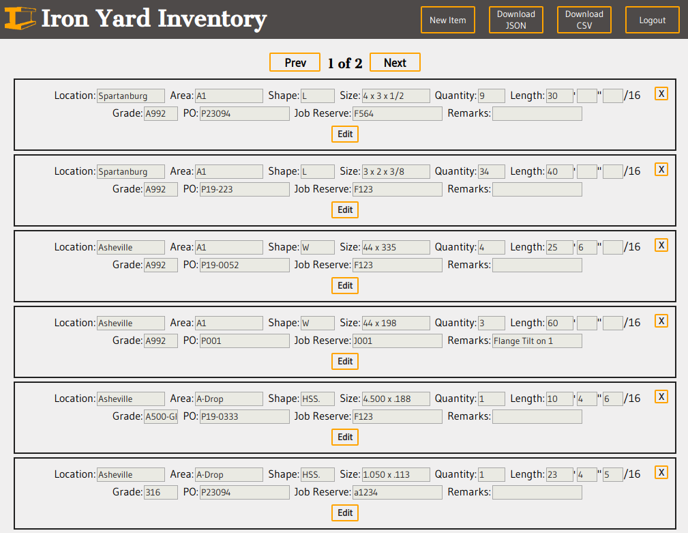

# Iron Yard Inventory Readme

### [Link to Live App](https://still-plains-53964.herokuapp.com/)

### API 
[Repo of API found here](https://github.com/watkins-tim/Iron-Yard-Inventory-Server)

#### Endpoints

##### User Endpoints /api/user/

**Post**

  Required fields: firstName', 'lastName', 'username', 'password', 'companyID'
  Returns: user information

**Get**

  Required: bearer auth token
  Returns: user information
 
 **Delete and Put endpoints coming in V2.0 with access limited to users with admin privileges**
 
##### Inventory Endpoints /api/item

**Post**

  Required: bearer auth token
  Required Fields: 'location', 'area', 'quantity', 'shape', 'size'
  Returns: new item
  
  
**Put**

Required: bearer auth token
Returns: updated item

**Delete**

Required: bearer auth token, id of item to delete at the end of url parameter /:id

**Get**

Required: bearer auth token, page parameter
Returns: 20 items at a time (page 0 is first 20 items, page 1 is second 20 items, etc... sorted by newest added)

**Get** /csv

Required: bearer auth token
Returns: All inventory items for the user's company in CSV format

**Get** /json

Required: bearer auth token
Returns: All inventory items for the user's company in JSON format

#####Authentication Endpoints /api/auth/

**Post** /login
Required: valid username and password
Returns: bearer auth token

**Post** /refresh
Required: valid bearer auth token
Returns: a new bearer auth token

### Screenshots

### Summary

This app is designed for steel mills, fabricators and service centers.  It allows these companies to conduct auditing operations from the field.  Personnel can go into the field and report the inventory in different storage locations.  Users can also download this information in CSV or JSON format to upload into their ERP software or conduct auditing operations in spreadsheet software.

Currently companies have to be created by the Iron Yard Inventory server manager. You cannot create a company as a user. 

I developed this app as it has real life applications.  I work for a structural steel fabricator.  Every year we have an audit of the tens of thousands of items in our inventory.  This process requires many hours of recording items on paper, followed by many more hours of data entry into excel sheets, culminating in one last upload into FabSuite, steel fabrication software package.  Iron Yard Inventory aims to eliminate the inefficiencies and human error common with our current procedure. 

**V2.0**

V2.0 will include features such as: 

* Admin privileges and limiting privileges of normal employees, filters for area, shape, size. 
* QC feature: each new item will be shaded orange until a different employee has verified the accuracy of the input.
* Continuous Audit Trail: currently only creator and last edit information is tracked. Every change/QC of an item will be be tracked in V2.0

### Technology

**Front End:** React, CSS
**Server:** Node-Express
**Authentication:** Passport
**Database:** Mongo/Mongoose

